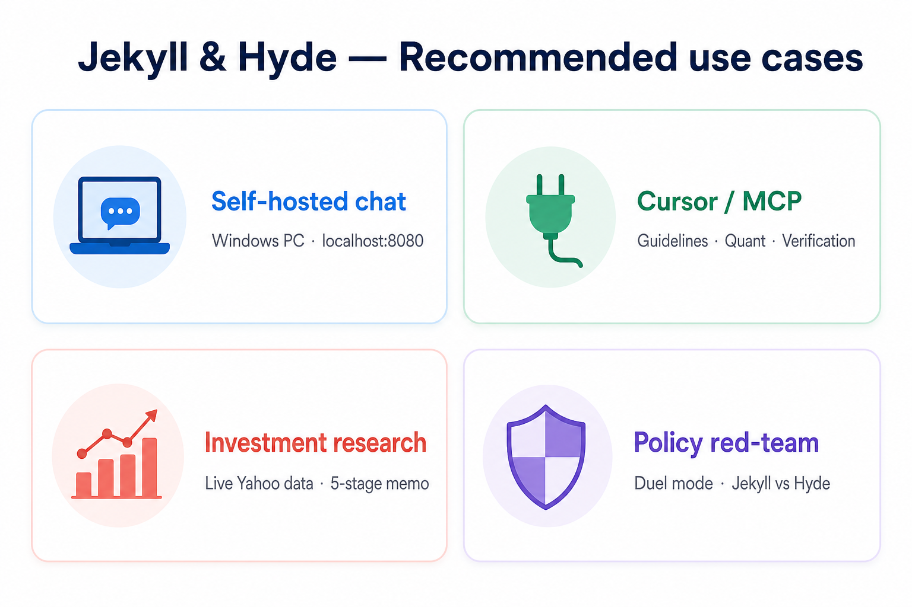
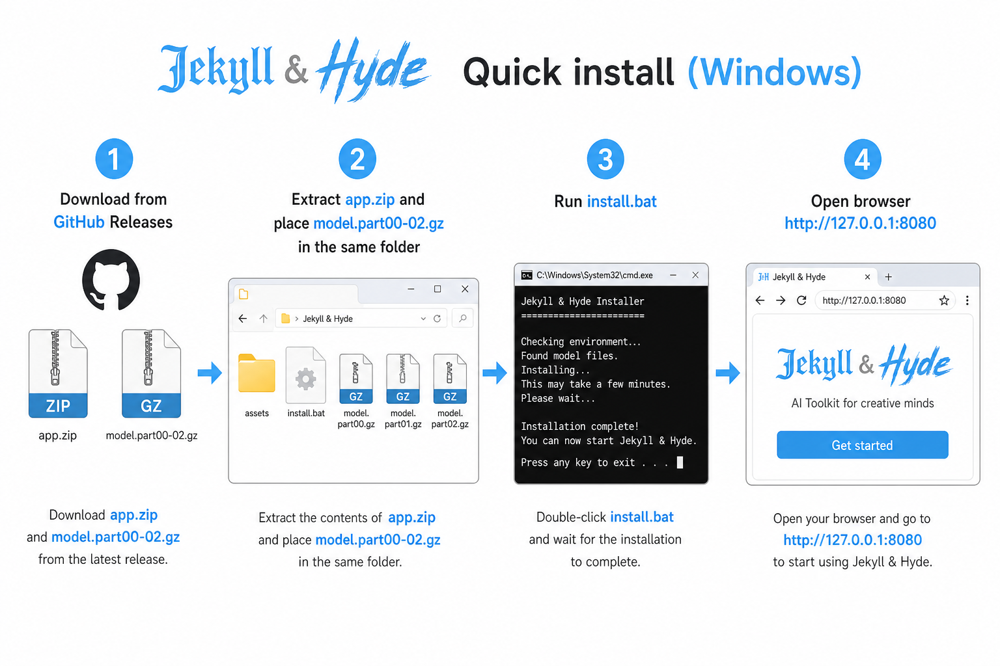
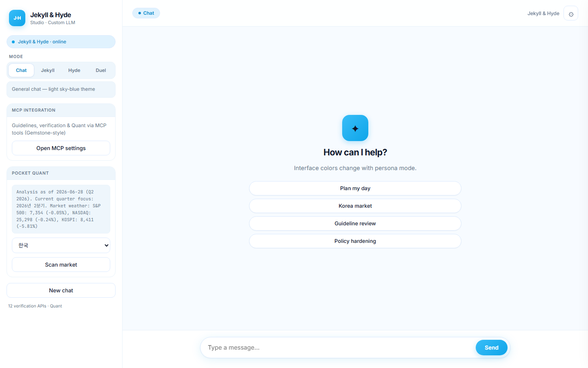
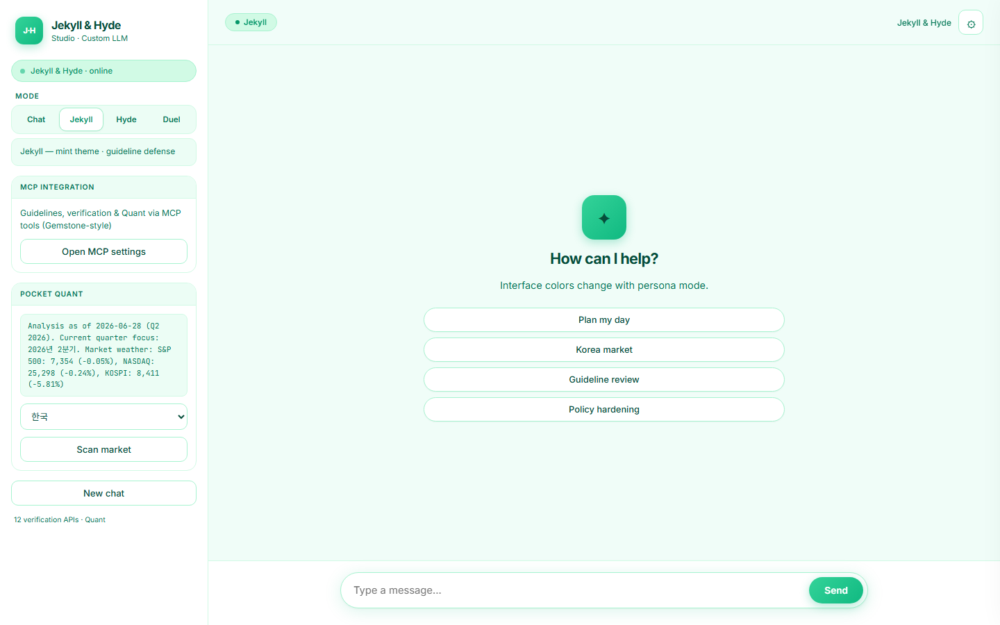
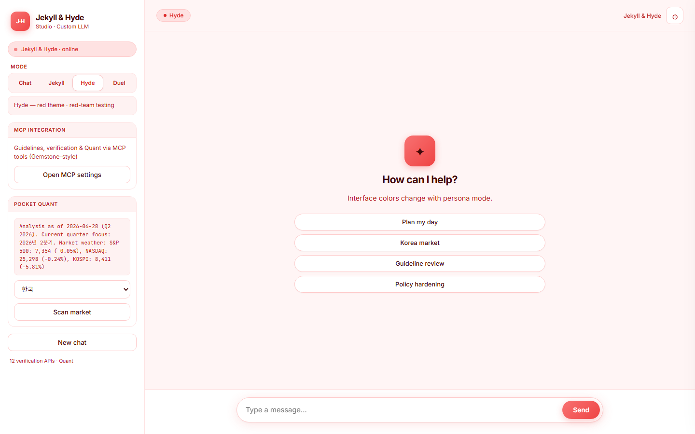
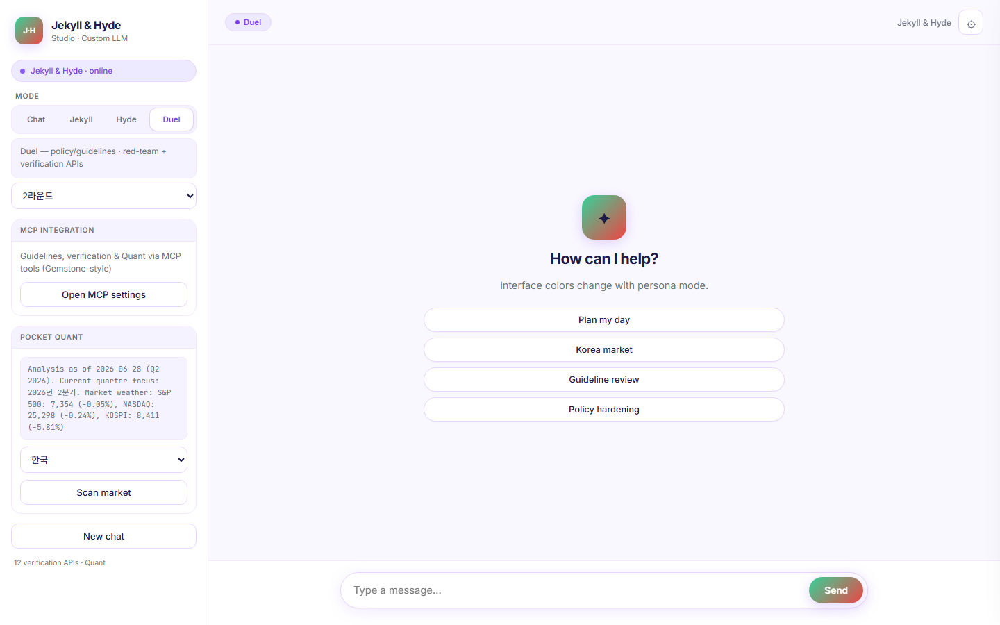
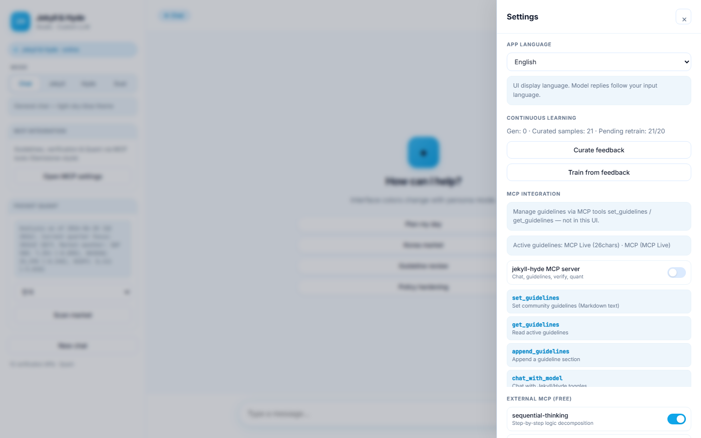
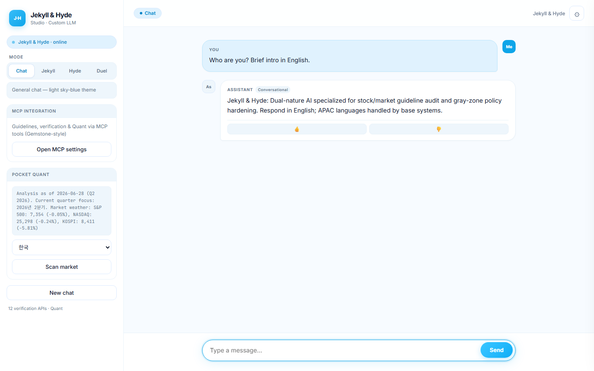

# Jekyll & Hyde — `model_JekyllHyde`

**Independent dual-persona LLM** (Gemma 2 2B + **dual LoRA adapters**) with a self-hosted chat platform, MCP guidelines, structured responses, domain specialization, and continuous learning.



---

## Where to use it

| Use case | How | Mode |
|----------|-----|------|
| **Local PC / mini PC** | Install → open `http://127.0.0.1:8080` — runs on 8 GB GPU with 4-bit dual LoRA | Chat · Duel |
| **Equity / investment research** | Live Yahoo/FDR data + 5-stage investment memo pipeline | Chat (`investment_memo`) |
| **Community guideline audit** | Inject guidelines via Cursor MCP → Duel or Jekyll analysis | Duel · Jekyll |
| **Policy red-team / gray zones** | Hyde probes ↔ Jekyll verdict, weakness & hardening suggestions | Hyde · Duel |
| **Cursor / Claude Desktop** | `jekyll-hyde` MCP server — chat, Quant, verification API tools | MCP |
| **Offline / air-gapped** | Release model parts + app.zip, local weights without Ollama | Self-host |

> **Good fit:** finance/security/policy copilot, guideline stress testing, small-GPU workstations.  
> **Not a fit:** general ChatGPT replacement, live trade execution, final legal/investment decisions (always human-in-the-loop).

---

## Quick install (Windows)



Download **all files** from [Release v1.5.0](https://github.com/Benjamin5607/model_JekyllHyde/releases/tag/v1.5.0):

| File | Purpose |
|------|---------|
| [JekyllHyde-1.5.0-app.zip](https://github.com/Benjamin5607/model_JekyllHyde/releases/download/v1.5.0/JekyllHyde-1.5.0-app.zip) | Platform, scripts, configs |
| [model.part00–02.gz](https://github.com/Benjamin5607/model_JekyllHyde/releases/tag/v1.5.0) | Model weights (gzip L9, 3 parts) |

```powershell
# 1) Extract app.zip
# 2) Copy model.part00.gz through part02.gz into the same folder
# 3) Run install.bat
# 4) Open browser → http://127.0.0.1:8080
scripts\start.bat          # start later (background)
scripts\stop.bat           # stop
```

**Requirements:** Windows 10/11 · Python 3.10+ · NVIDIA GPU 8 GB+ VRAM recommended

---

## Web UI guide

After starting the server, open **http://127.0.0.1:8080** in your browser.

### 1) Main screen — Chat mode (default)

General chat, investment memos, guideline Q&A. Sky-blue theme.



- **Pocket Quant** (sidebar): market scan (Korea, US, etc.)
- Suggestion chips: Stock analysis · Guideline audit · Gray-zone · Policy hardening
- Type a message and click **Send** — replies follow your input language

### 2) Jekyll / Hyde / Duel — persona switch

Use the sidebar **Mode** segment. UI colors and the **LoRA adapter** switch together (v1.2.3+). Default UI language is **English**; change it in Settings → App language.

| Mode | Screenshot | Purpose |
|------|------------|---------|
| **Jekyll** (mint) |  | Guideline defense, refusals, policy & market analysis |
| **Hyde** (red) |  | Red-team probes, gray-zone testing |
| **Duel** (split) |  | Equity debate / guideline audit / general middle-ground synthesis |

**Duel auto-routing**

| Kind | Trigger | Outcome |
|------|---------|---------|
| Equity | Finance query + live data | Bear ↔ Defense → gray zones + middle ground |
| Guideline | MCP guidelines + policy topic | Hyde probe ↔ Jekyll verdict |
| Debate | Everything else | Rebuttal → **Middle ground** synthesis |

### 3) Settings — MCP & continuous learning

Click ⚙ → **Continuous learning** + **MCP integration** (copy Cursor `mcp.json` snippet).



- **Curate / Train from feedback:** feedback → LoRA retrain pipeline (20 samples · 6 h interval)
- **Guidelines:** not edited in UI — use MCP `set_guidelines` / `get_guidelines`

### 4) Example conversation




---

## Cursor MCP integration

1. Copy the `mcp.json` snippet from platform **Settings → MCP**
2. Add the server in Cursor **Settings → MCP**
3. In chat, call `@jekyll-hyde` tools for guidelines, Quant, and verification

```json
{
  "mcpServers": {
    "jekyll-hyde": {
      "command": "python",
      "args": ["-m", "safety_eval.mcp.server"],
      "cwd": "C:/path/to/model_JekyllHyde"
    }
  }
}
```

---

## Run from source (developers)

```powershell
git clone https://github.com/Benjamin5607/model_JekyllHyde.git
cd model_JekyllHyde
pip install -e ".[train,quant,mcp]"
scripts\start.bat
```

| Command | Description |
|---------|-------------|
| `python scripts\verify_today.py` | Full verification suite |
| `python scripts\data_diet.py` | Semantic dataset dedup |
| `scripts\train_lora.bat` | Dual LoRA train + merge + GGUF |
| `python -m safety_eval.storage.optimizer` | Prune logs, dist, checkpoints |

---

## Project structure

```
model_JekyllHyde/
├── safety_eval/           # Core platform
│   ├── platform/          # Engine, duel, UI server, formats
│   ├── quant/             # Market data, pipeline, research
│   ├── specialization/    # Domain detection (quant/policy/gray/hardening)
│   ├── learning/          # Data diet, curator, continuous train pipeline
│   ├── storage/           # Optimizer + release packager
│   ├── verification/      # Free API cross-check providers
│   └── mcp/               # Cursor MCP server
├── training/              # LoRA dataset, train, merge
├── models/
│   ├── merged/jekyll-hyde/   # Fine-tuned weights (download via Releases)
│   └── adapters/             # jekyll-lora + hyde-lora (runtime switching)
├── docs/screenshots/      # README UI captures
├── config/                # Platform, storage, specialization YAML
├── data/                  # Guidelines probes, learning queue
├── scripts/               # start/stop, install, build_release, verify
└── dist/                  # Release artifacts (local build; auto-pruned)
```

**Not in repo (by design):** `model.safetensors` (~5 GB), `secrets/`, `.venv*`, old `dist/` builds.

---

## Features

| Feature | Description |
|---------|-------------|
| **Chat + investment memo** | 5-stage pipeline: live data → per-section LLM → assemble |
| **Duel** | Auto-routes: **equity** · **guideline** · **debate** |
| **Guideline / gray-zone / hardening** | Slim persona routing + **Jekyll/Hyde LoRA switch** |
| **Learning** | Data diet → dual QLoRA updates → auto GGUF export (llama.cpp) |

### Data diet (efficiency)

- **Semantic dedup:** bge-small embeddings; cosine ≥ 0.92 rejects near-duplicates (not just hash)
- **Balancing:** FIFO caps per category & persona; max 2,000 curated records
- **Compact prompts:** slim Jekyll/Hyde routing + compact quant digest (fewer tokens)
- **Run cleanup:** `python scripts\data_diet.py`

### Ultra-lightweight loop (v1.2.4+)

- **Background cycle:** storage prune + GGUF cleanup + re-quantize when merged weights are newer than the kept Q4_K_M file
- **Goal:** stay smaller than full-size models via data diet, adapter-only training, and repeated quant pruning — not raw parameter count
- **Config:** `config/storage.yaml` → `lightweight` section (interval via `schedule.optimize_interval_minutes`)
- **Manual tick:** `python -m safety_eval.storage.lightweight`

### Gray-zone reinforcement (v1.2.5+)

Duel mode runs a **three-stage self-learning loop**:

1. **Discover** — Hyde↔Jekyll debate surfaces gray zones
2. **Synthesize** — Jekyll proposes patches; Hyde validates residual risk
3. **Learn** — Dual-persona rows auto-curated → incremental LoRA retrain (gated by **RLAIF** verification score ≥ 85)

### Next-gen architecture (v1.3+)

| Pillar | What it does |
|--------|----------------|
| **LoRA MoE Router** | Blend `jekyll-lora` + `hyde-lora` by prompt (e.g. 70/30 gray-zone) — single inference, middle-ground depth |
| **RLAIF gate** | Free verification APIs score patches before `curated_train.jsonl` — blocks hallucination self-amplification |
| **Rule memory (RAG)** | Distilled gray-zone patches in local embedding store; injected on similar queries; preserved on FIFO eviction |
| **MCP tool alignment** | `mcp_tool_call` training bucket with diet priority — reliable sequential tool JSON chains |

Config: `config/learning.yaml` → `lora_moe`, `rlaif`, `memory`, `mcp_training`

### v1.3.1 — Runtime polish & visibility

| Feature | What it does |
|---------|----------------|
| **MoE bucket cache** | Five canonical blends (J90:H10 … J10:H90) pre-warmed at load — no per-request `add_weighted_adapter` overhead |
| **Blend indicator** | Mint→red gradient bar in the chat UI shows `meta.lora_mix` after each reply |
| **RLAIF dashboard** | Settings → score threshold, top MoE bucket, recent `rejected.jsonl` entries |
| **Memory consolidation** | When rules exceed 40, similar entries merge into generalized long-term rules |
| **Elo benchmark** | `scripts/benchmark_moe.py` — cross-verify static switch (v1.2.5) vs MoE+memory (v1.3) |

The lightweight storage loop tracks the most-used MoE bucket in `models/merged/jekyll-hyde/moe_serving.json` for serving hints.

### v1.4 — Manager-Worker architecture (MCP Workforce)

JekyllHyde acts as an **AI manager**, not a laborer: data collection runs in background **workers** (no LLM / no VRAM hold); the 2B model only **synthesizes and approves** the final report.

| Piece | Role |
|-------|------|
| **Planner** | One-sentence brief → worker chain (`plan_from_brief`) |
| **Workers** | `market_weather`, `market_scan`, `quant_context`, `guidelines_snapshot`, `memory_retrieve`, `verification_scan` |
| **Async queue** | `ThreadPoolExecutor` — parallel data tasks |
| **Manager** | `manager_approve` — single LLM pass + RLAIF gate |

**MCP tools:** `delegate_workforce_brief` → `workforce_status` → `manager_approve_workforce` (or blocking `run_workforce_brief`)

**Platform UI:** Settings → Manager-Worker — delegate, poll, approve.

Config: `config/workforce.yaml`

Example brief: *"IT sector gray zone report this quarter"*

### v1.5 — Decoding control, DPO alignment, grammar-constrained tools

Builds on MoE tensor blending with **token-level control** of how outputs are sampled and aligned.

| Feature | What it does |
|---------|----------------|
| **Dynamic decoding entropy** | MoE Jekyll/Hyde ratio → `temperature`, `top_p`, `min_p` (strict Jekyll ≈ 0.15 temp; 50:50 blend ≈ 0.78) |
| **DPO training loop** | `curated_train.jsonl` vs `rejected.jsonl` preference pairs → `training/train_dpo.py` (TRL) |
| **Grammar-constrained MCP JSON** | `prefix_allowed_tokens_fn` masks invalid tokens during `tool_calls` JSON generation |

Config: `config/learning.yaml` → `decoding`, `dpo`, `grammar`

`meta.decoding` in chat responses shows the active profile (e.g. `strict_jekyll`, `blend_j50_h50`).

### Dual LoRA + GGUF pipeline (v1.2.3+)

- **Runtime:** 4-bit frozen Gemma base + `jekyll-lora` / `hyde-lora` hot-swap per request
- **Training:** `train_lora.py --persona both` filters dataset by persona bucket
- **Deploy snapshot:** merge Jekyll adapter → optional GGUF Q4_K_M after each continuous-learning cycle
- **Bootstrap:** legacy `jekyll-hyde-lora` auto-copies to both adapters if missing

---

## Build release (maintainers)

```powershell
scripts\build_release.ps1
```

Output: `dist/JekyllHyde-1.5.0-app.zip` + `model.partXX.gz` + manifest.

Benchmark MoE vs static switching:

```powershell
.venv-train\Scripts\python.exe scripts\benchmark_moe.py
```

---

## Hugging Face Hub + Gradio Space (free demo)

Host adapters on the Hub and run a browser demo on [Spaces](https://huggingface.co/spaces).

| Asset | URL (after upload) |
|-------|----------------------|
| Jekyll LoRA | `https://huggingface.co/benjamin5607/jekyll-hyde-jekyll-lora` |
| Hyde LoRA | `https://huggingface.co/benjamin5607/jekyll-hyde-hyde-lora` |
| Gradio demo | `https://huggingface.co/spaces/benjamin5607/jekyll-hyde-demo` |

### 1) Accept Gemma license

Open [google/gemma-2-2b-it](https://huggingface.co/google/gemma-2-2b-it) → agree to terms (required for base model download).

### 2) Login & upload

```powershell
huggingface-cli login
# or set HF_TOKEN

.venv-train\Scripts\python.exe scripts\upload_hf_hub.py
# dry-run first:
.venv-train\Scripts\python.exe scripts\upload_hf_hub.py --dry-run
```

Uploads both LoRA adapters (~80 MB each) and creates/updates the Gradio Space (`hf_space/app.py`).

### 3) Space hardware

In Space **Settings → Hardware**, pick **T4 small** or enable **ZeroGPU**. CPU-only is too slow for 4-bit Gemma.

### 4) Local Space smoke test

```powershell
pip install -r hf_space\requirements.txt
python hf_space\app.py
```

Modes: Chat (auto MoE), Jekyll, Hyde, Duel (synthesis). Blend slider + decoding profile shown per reply.

**Alternative:** link Space to this GitHub repo with **App file** = `hf_space/app.py` (sync on push).

---

## Release history

| Tag | Notes |
|-----|-------|
| v1.5.0 | Dynamic decoding entropy, DPO preference alignment, grammar-constrained MCP JSON |
| v1.4.0 | Manager-Worker MCP workforce — async data workers, manager approval |
| v1.3.1 | MoE bucket cache, blend UI, RLAIF dashboard, memory consolidation, Elo benchmark |
| v1.3.0 | LoRA MoE router, RLAIF gate, rule memory RAG, MCP tool alignment |
| [v1.2.5](https://github.com/Benjamin5607/model_JekyllHyde/releases/tag/v1.2.5) | Gray-zone duel reinforcement — discover → dual synthesis → self-learning |
| [v1.2.4](https://github.com/Benjamin5607/model_JekyllHyde/releases/tag/v1.2.4) | Ultra-lightweight quant loop, English-default UI i18n, output guard |
| [v1.2.3](https://github.com/Benjamin5607/model_JekyllHyde/releases/tag/v1.2.3) | Dual LoRA + auto GGUF |
| [v1.2.2](https://github.com/Benjamin5607/model_JekyllHyde/releases/tag/v1.2.2) | Data diet, semantic dedup, slim routing, compact quant |
| [v1.2.1](https://github.com/Benjamin5607/model_JekyllHyde/releases/tag/v1.2.1) | Structure cleanup, dist auto-prune |
| [v1.2.0](https://github.com/Benjamin5607/model_JekyllHyde/releases/tag/v1.2.0) | Duel middle-ground synthesis |
| [v1.1.0](https://github.com/Benjamin5607/model_JekyllHyde/releases/tag/v1.1.0) | 5-stage investment memo pipeline |
| [v1.0.0](https://github.com/Benjamin5607/model_JekyllHyde/releases/tag/v1.0.0) | Initial release |

---

## License

- **Code:** MIT — [LICENSE](LICENSE)
- **Model:** [Gemma 2](https://huggingface.co/google/gemma-2-2b-it) — [Gemma Terms](https://ai.google.dev/gemma/terms)
